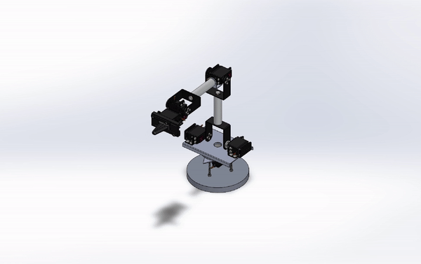
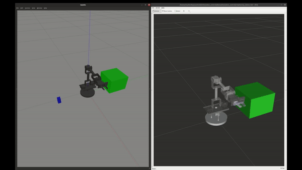
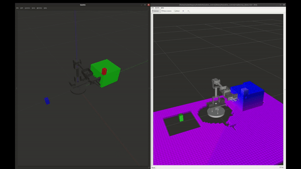
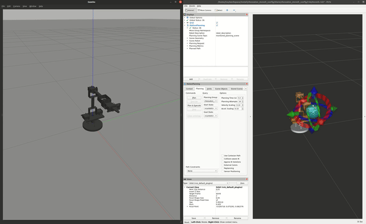

# CHESSATON


chess playing 4dof robotic arm!
## Description
This ROS package contains the motion planning stack and chess interface (which uses my chess engine [Kojiro](https://github.com/Babak-SSH/Kojiro/blob/main/)) for a semi-custom 4 DOF robotic arm.
The associated simulation environment in Gazebo includes a chess-board and its pieces with the same size as their real-life counterparts, and to simulate grasping, [gazebo_grasp_plugin](https://github.com/JenniferBuehler/gazebo-pkgs/tree/master/gazebo_grasp_plugin) is used.
The robotic manipulator hardware is controlled using micro-ros + esp32 + pca9685.

<p align="center">
    <a href="https://youtu.be/DYEWLB1PKyM" target="_blank" rel="noopener noreferrer">
        
    </a>
</p>

### packages
- [chessaton_description](./chessaton_description/README.md) : robots urdfs and base configurations
- [chessaton_moveit_config](./chessaton_moveit_config/README.md) : chessaton moveit2 stack
- [chessaton_control](./chessaton_control/README.md) : a group of interfaces to control the arm and some demos of pick & place
- [chessaton_chess_manager](./chessaton_chess_manager/README.md) : chess-related interfaces that help the robotic arm to play chess
- [micro_ros_esp](./micro_ros_esp/README.md) : bridge between main pc and esp32 to control servos
- [chessaton_interfaces](./chessaton_interfaces/README.md) : custom data types
- [chessaton_chessaton_arm_ikfast_plugin](./chessaton_chessaton_arm_ikfast_plugin/README.md) : 4dof kinematic solver made with ikfast
- [CAD](./CAD/) : assemblies and design of parts
<div align="center">
    
</div>

## Building

### Docker
```bash
cd chessaton
docker compose build
docker compose up -d chessaton-nvidia
docker exec -it ros_humble_nvidia /bin/bash
```
to enable Nvidia GPU:
#### Linux:
add this config to daemon.json which is usually located at /etc/docker/daemon.json:
```json
{
    "runtimes":{
        "nvidia":{
            "path":"/usr/bin/nvidia-container-runtime",
            "runtimeArgs":[
                
            ]
        }
    }
}
```
#### Windows
if docker desktop doesn't look for /etc/docker/daemon.json (in wsl),
 add the above config to daemon.json in the **Docker Desktop Settings under Docker Engine**.
also, to show GUI apps you will need X server.

---
### Manual

core dependencies:

- ros-humble
- gazebo
- moveit2
- [grasp-plugin](https://github.com/JenniferBuehler/gazebo-pkgs)

rest of the dependencies can be found in [Dockerfile](./Dockerfile)

## Running nodes
### Chess
for more refer to [chessaton_chess_manager](./chessaton_chess_manager/README.md)

```bash
ros2 launch chessaton_chess_manager chess_robot.launch.py engine:=kojiro
```

|<br>e2e4-e7e5|<br>e1g1 (castling)|
|:-:|:-:|

### Pick & Place
for more refer to [chessaton_control](./chessaton_control/README.md)
#### Pick and Place with predefined poses
```
ros2 launch chessaton_control pick_place_demo.launch.py demo_program:="pick_place_demo"
```

<div>
    <div align="center">
        
    </div>
</div>

#### Pick and Place using a depth map to avoid collision
```
ros2 launch chessaton_control pick_place_camera_demo.launch.py demo_program:="pick_place_depth_demo" world:=/home/ros/workspace/src/chessaton/chessaton_control/world/simple_pick_place_obstacle
```

<div>
    <div align="center">
        
    </div>
</div>

### moveit2
```bash
ros2 launch chessaton_moveit_config chessaton.launch.py use_camera:=false
```

<div>
    <div align="center">
        
    </div>
</div>
