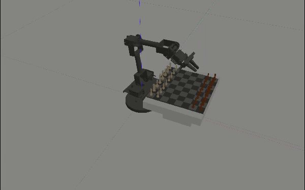
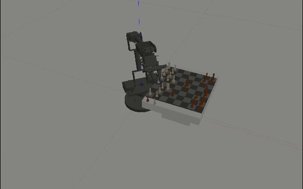

# chessaton_chess_manager

class and programs to play chess using the chessaton arm.

```bash
.
├── CMakeLists.txt                          # colcon-enable CMake recipe
├── include                                 # [dir] header files
│   ├── chess_handler.hpp                   # chess_handler header
│   └── position.hpp                        # declaration of position related variables
├── launch                                  # [dir] Ros2 launch scripts
│   ├── chess_demo.launch.py                # launch script to run chess_demo
│   └── chess_robot.launch.py               # launch script to run chess_robot (to play chess on both sides)
├── models                                  # [dir] models of chessboard and chess pieces
│   ├── bishop_black
│   │   ├── meshes
│   │   │   └── bishop.dae
│   │   ├── model.config
│   │   └── model.sdf
|   .
|   .
|   .
│   └── rook_white
│       ├── meshes
│       │   └── rook.dae
│       ├── model.config
│       └── model.sdf
├── package.xml                             # Ros2 package metadata
├── README.md
├── src                                     # [dir] source files
│   ├── chess_demo.cpp                      # simple program to move a king piece in rows in chessboard
│   ├── chess_engine.cpp                    # Ros2 service to get the bestmove from chess engine
│   ├── chess_handler.cpp                   # chess_handler class handles chess moves 
│   ├── chess_robot.cpp                     # chessaton plays a chess game as both sides
│   ├── engines                             # [dir] chess engines
│   │   └── kojiro                          # my chess engine
│   └── position.cpp                        # definition and values of position related variables
└── worlds                                  # [dir] world files for gazebo
    ├── chessboard                          # a chessboard with pieces in standard start position
    └── chessboard_demo                     # a chessboard with a king piece
```

## chess demo
```bash
ros2 launch chessaton_chess_manager chess_demo.launch.py
```

## chess
```bash
ros2 launch chessaton_chess_manager chess_robot.launch.py engine:=kojiro
```
- if perfection is preferred, other chess engines such as stockfish could be used., just put the executable file in ./src/engines and change the engine parameter in the command.

|<br>e2e4-e7e5|<br>e1g1 (castling)|
|:-:|:-:|

## chess on real robot without simulation
```bash
ros2 launch chessaton_chess_manager chess_robot.launch.py use_sim_time:=false ros2_control_plugin:=fake gazebo_sim:=false
```