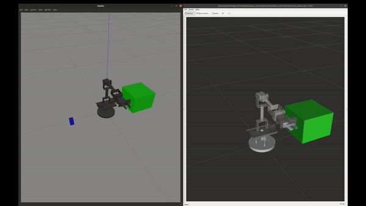

# chessaton_control

chessaton's class and interface to control and command movements of arm.

```bash
.
├── CMakeLists.txt                          # colcon-enable CMake recipe
├── include                                 # [dir] header files
│   └── action_handler.hpp                  # action_handler header 
├── launch                                  # [dir] Ros2 launch scripts
│   ├── mtc_demo.launch.py                  # launch script to run moveit_task_constructor demo
│   ├── pick_place_camera_demo.launch.py    # launch script to run a pick&place demo with camera for depth and opencv demos
│   └── pick_place_demo.launch.py           # launch script to run a pick&place demo
├── package.xml                             # Ros2 package metadata
├── README.md
├── rviz                                    # rviz setups
│   ├── movep_demo.rviz                     # setup to show planned trajectories
│   └── mtc_demo.rviz                       # setup for moveit_task_constructor setup
├── scripts                                 # [dir] Additional scripts
├── src                                     # [dir] source files
│   ├── action_handler.cpp                  # actions_handler class to control actions of robot
│   ├── find_object_position.cpp            # Ros2 service to find positions of the boxes using opencv
│   ├── movep_demo.cpp                      # demo program to give custom position or pose to robot through CLI
│   ├── mtc_pick_place_demo.cpp             # moveit_task_constructor demo
│   ├── pick_place_demo.cpp                 # pick&place of a box with given coordinates
│   ├── pick_place_depth_demo.cpp           # pick&place of a box with collision avoidance using depth map(octo map)
│   └── pick_place_opencv_demo.cpp          # pick&place of a box using opencv as a ros serviceto find the coordinates
└── world                                   # [dir] world files for gazebo
    ├── simple_pick_place                   # two boxes to perform pick&place demos
    └── simple_pick_place_obstacle          # three boxes, one is obstacle
```
- action handler is the base class to control the robots arm and hand and is used for creating the chess_manager, aside from action control functions there are functions to visualize planned trajectories in rviz, attach objects and handle collisions between them. 

## moveit task constructor:
```
ros2 launch chessaton_control mtc_demo.launch.py
```

## move to given position/pose:
- first launch simulation in a terminal :
```
ros2 launch chessaton_moveit_config chessaton.launch.py rviz_config:='./src/chessaton/chessaton_control/rviz/movep_demo.rviz'
```
- then run the movep_demo and choose position or pose as coordinate :
```
ros2 run chessaton_control movep_demo
```

## pick and place demos:
### pick and place with predefined poses
```
ros2 launch chessaton_control pick_place_demo.launch.py demo_program:="pick_place_demo"
```

<div>
    <div align="true">
        
    </div>
</div>

### pick and place using depth map to avoid collision
```
ros2 launch chessaton_control pick_place_camera_demo.launch.py demo_program:="pick_place_depth_demo" world:=/home/ros/workspace/src/chessaton/chessaton_control/world/simple_pick_place_obstacle
```

<div>
    <div align="true">
        
    </div>
</div>

### pick and place with OpenCV
- in this part classic algorithms are used to find the boxes position and convert them to useful pose by fusing them with point cloud data from camera for robot to use (certainly there are more robust and elegant solutions TODO: change algorithms to find boxes), these coords are then sent with Ros2 service call to any program that requests it. 
```
ros2 launch chessaton_control pick_place_camera_demo.launch.py demo_program:="pick_place_opencv_demo" enable_service:=true
```

<div>
    <div align="true">
        
    </div>
</div>