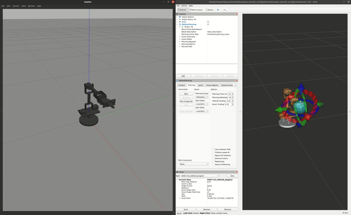

# chessaton_moveit_config

```bash
.
├── CMakeLists.txt                          # colcon-enabled cmake recipe
├── config                                  # [dir] config files for moveit2
│   ├── chessaton_controllers.yaml          # configuration of Ros2 controllers for different command interfaces
│   ├── joint_limits.yaml                   # velocity and acceleration limits
│   ├── kinematics_4dof.yaml                # ikfast produced kinematics (there are some limits with this kinematic for now)
│   ├── kinematics.yaml                     # default kinematics solver configuration
│   ├── ompl_planning.yaml                  # ompl planner configurations
│   ├── sensor_3d.yaml                      # octomap settings
│   └── servo.yaml                          # configuration for moveit_servo
├── launch                                  # [dir] Ros2 launch scripts
│   └── chessaton.launch.py                 # launch script for configuring motion planning, rviz, gazebo and movegroup
├── package.xml                             # Ros2 package metadata
├── README.md
├── rviz                                    # [dir] rviz setups
│   └── moveit.rviz                         #rviz2 stup for moveit2 stack
├── scripts                                 # [dir] Additional scripts
│   └── xacro2srdf.bash                     # convert xacro to srdf
└── srdf                                    # [dir] srdf description (xacro)
    ├── chessaton_macro.srdf.xacro          # macro for srdf 
    ├── chessaton.srdf                      # semantic information about the robot structure
    └── chessaton.srdf.xacro                # main srdf file
```

- kinematics_4dof.yaml is the kinematic solver produced by ikfast which have some problems when used with moveit2, because moveit2 is made for arms with 6 and higher dof. to overcome this issue for now, two virtual (fake) joints have been added to hand section (yaw and roll) to be able to use 6dof kinematic solvers.

TODO: fix 4dof kinematic solver
## nodes

```bash
ros2 launch chessaton_moveit_config chessaton.launch.py use_camera:=false
```

<div>
    <div align="center">
        
    </div>
</div>