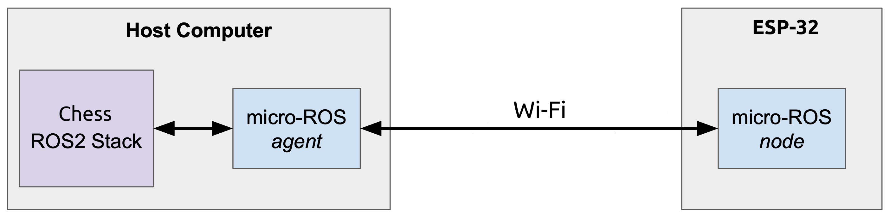

# micro-ros esp32
this program provides means of communication between main PC's ROS2 nodes and esp32 using micro-ros.

we subscribe to /joint_states topic and convert them to commands that we can feed to servo motors using esp32.

## other
- microcontroller: ESP-32 WROOM 32U
- servo type: mg946R
- power volatage: 7 volt
- servo driver: pca9685